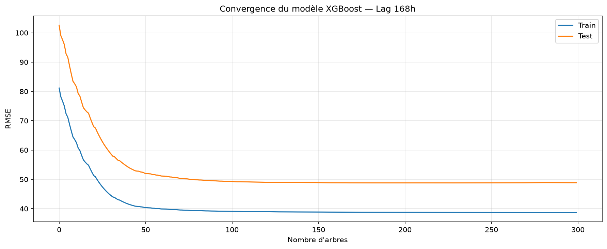
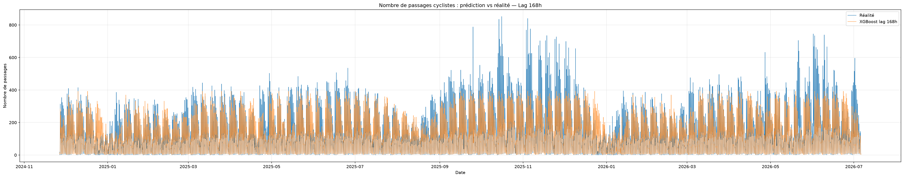
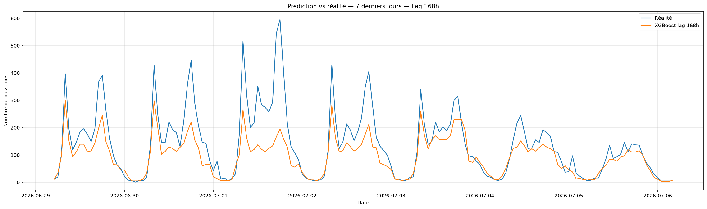
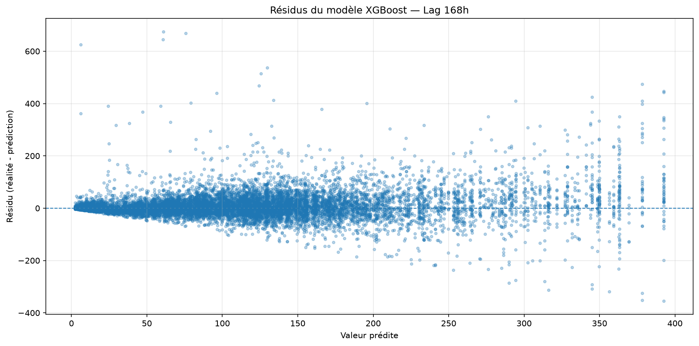
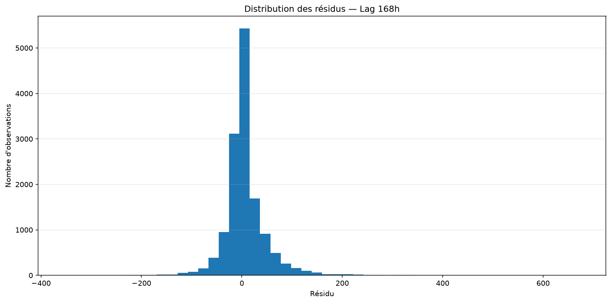
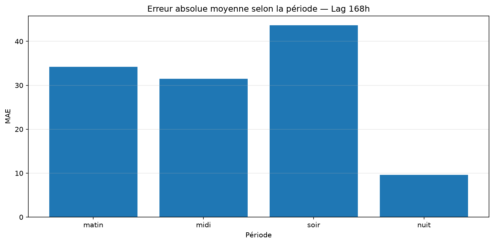
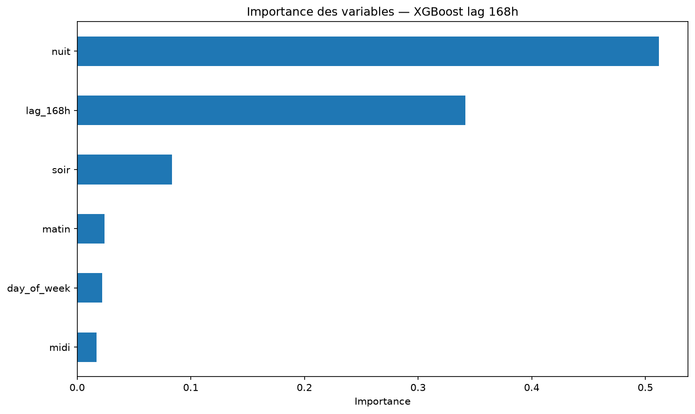

# Model Card — Prédiction du trafic cycliste — Lag 168h

    > Document généré automatiquement le 2026-10-02 09:43:54 UTC

    ---

    ## 1. Présentation

    Ce modèle a pour objectif de prédire le nombre de passages cyclistes
    observés par heure sur le compteur étudié.

    Le problème est traité comme un problème de **régression sur série
    temporelle**.

    Le modèle utilisé est un **XGBoost Regressor**.

    La particularité de cette expérience est l'utilisation d'un
    **lag de 168 heures**, soit une semaine.

    La variable cible est `counts`.

    ---

    ## 2. Données

    Le modèle utilise le dataset Silver produit lors de l'étape de
    préparation des données.

    ### Période disponible

    - Première observation : `2018-06-18 00:00:00+00:00`
    - Dernière observation : `2026-07-06 04:00:00+00:00`

    ### Volumétrie

    | Dataset | Observations |
    |---|---:|
    | Silver | 70,565 |
    | Après création des features | 70,323 |
    | Train | 56,258 |
    | Test | 14,065 |

    Les 168 premières observations sont exclues car elles ne disposent
    pas d'une valeur historique située une semaine auparavant.

    ---

    ## 3. Variables explicatives

    | Variable | Description |
    |---|---|
    | `lag_168h` | Nombre de passages observé 168 heures auparavant |
    | `day_of_week` | Jour de la semaine, de 0 (lundi) à 6 (dimanche) |
    | `matin` | Indicateur de la période du matin |
    | `midi` | Indicateur de la période du midi |
    | `soir` | Indicateur de la période du soir |
    | `nuit` | Indicateur de la période de nuit |

    Les données étant horaires et complètes, le lag de 168 heures est
    calculé en décalant la série de 168 lignes.

    **lag_168h(t) = counts(t - 168 heures)**

    168 heures correspondent à **7 jours**.

    Cette variable permet donc au modèle de connaître la fréquentation
    observée à la même position dans la série une semaine auparavant.

    ---

    ## 4. Séparation Train / Test

    La séparation est réalisée chronologiquement.

    | Jeu | Proportion |
    |---|---:|
    | Train | 80% |
    | Test | 20% |

    ### Train

    `2018-06-25 00:00:00+00:00` → `2024-11-26 23:00:00+00:00`

    ### Test

    `2024-11-27 00:00:00+00:00` → `2026-07-06 04:00:00+00:00`

    Les données ne sont pas mélangées afin de respecter leur structure
    temporelle.

    ---

    ## 5. Baseline J-7

    Une baseline hebdomadaire est utilisée comme référence.

    Pour chaque heure, la prédiction correspond directement au nombre
    de passages observé **168 heures auparavant**, soit une semaine.

    **prédiction(t) = counts(t - 168 h)**

    ### Performances de la baseline

    | Métrique | Valeur |
    |---|---:|
    | MAE | 28.10 |
    | RMSE | 51.10 |
    | R² | 0.762 |

    Cette baseline est particulièrement pertinente pour le trafic
    cycliste car elle permet de tester directement l'existence d'une
    régularité hebdomadaire dans la série.

    ---

    ## 6. XGBoost

    Le modèle utilisé est `XGBRegressor`.

    ### Hyperparamètres

    | Hyperparamètre | Valeur |
    |---|---:|
    | n_estimators | 300 |
    | learning_rate | 0.05 |
    | max_depth | 4 |
    | subsample | 0.8 |
    | colsample_bytree | 0.8 |
    | objective | reg:squarederror |
    | random_state | 42 |

    ---

    ## 7. Performances

    ### Comparaison avec la baseline J-7

    | Modèle | MAE | RMSE | R² |
    |---|---:|---:|---:|
    | Baseline J-7 | 28.10 | 51.10 | 0.762 |
    | XGBoost lag 168h | 26.90 | 48.86 | 0.782 |

    ### Évolution par rapport à la baseline

    - MAE : **+4.26 %**
    - RMSE : **+4.37 %**

    Une valeur positive signifie que XGBoost réduit l'erreur par rapport
    à la baseline J-7.

    ---

    ## 8. Convergence

    

    Le graphique représente l'évolution de la RMSE au cours de
    l'entraînement du modèle.

    ---

    ## 9. Prédictions vs réalité

    ### Ensemble du jeu de test

    

    ### Zoom sur sept jours

    

    Le zoom permet d'observer la capacité du modèle à reproduire les
    variations horaires et hebdomadaires du trafic.

    ---

    ## 10. Analyse des résidus

    Le résidu est défini comme :

    **résidu = valeur réelle - valeur prédite**

    

    Un résidu positif correspond à une sous-estimation.

    Un résidu négatif correspond à une surestimation.

    ### Distribution

    

    ---

    ## 11. Performances par période

    | Période | Observations | MAE | RMSE | R² |
|---|---:|---:|---:|---:|
| matin | 2930 | 34.24 | 66.11 | 0.726 |
| midi | 2344 | 31.49 | 43.51 | 0.428 |
| soir | 3516 | 43.64 | 64.25 | 0.587 |
| nuit | 5275 | 9.62 | 18.60 | 0.684 |

    

    Cette analyse permet d'identifier les périodes de la journée pour
    lesquelles les prédictions sont les plus ou les moins précises.

    ---

    ## 12. Importance des variables

    | Variable | Importance |
|---|---:|
| nuit | 0.5121 |
| lag_168h | 0.3415 |
| soir | 0.0833 |
| matin | 0.0240 |
| day_of_week | 0.0219 |
| midi | 0.0171 |

    

    L'importance des variables indique leur utilisation relative par
    XGBoost.

    Elle ne doit pas être interprétée comme une relation causale.

    ---

    ## 13. Critères de validation

    Le modèle est évalué à l'aide de :

    - la MAE ;
    - la RMSE ;
    - le R² ;
    - une baseline hebdomadaire J-7 ;
    - l'analyse de la convergence ;
    - la comparaison prédiction / réalité ;
    - l'analyse des résidus ;
    - l'analyse des performances par période ;
    - l'importance des variables.

    ---

    ## 14. Intérêt du lag 168h

    Le lag de 168 heures correspond à une semaine complète.

    Il permet de fournir au modèle une information historique située au
    même moment du cycle hebdomadaire précédent.

    Cette expérience pourra être comparée au modèle utilisant un lag de
    24 heures afin d'étudier si une information quotidienne ou
    hebdomadaire est la plus pertinente pour la série étudiée.

    ---

    ## 15. Limites

    Le modèle reste volontairement simple.

    Il ne prend notamment pas en compte :

    - la météo ;
    - les précipitations ;
    - la température ;
    - les jours fériés ;
    - les vacances scolaires ;
    - les événements locaux ;
    - les travaux ;
    - d'autres variables de saisonnalité.

    Une extension possible serait de construire un modèle utilisant
    simultanément les lags **24h et 168h**.

    ---

    ## 16. Utilisation prévue

    Ce modèle est destiné à l'étude expérimentale de la fréquentation
    cycliste et à la comparaison de différentes stratégies de
    prédiction temporelle.

    Il n'est pas destiné à une utilisation critique ou à une prise de
    décision automatisée.

    ---

    ## 17. Artefacts générés

    Le pipeline génère :

    - `xgboost_model_168h.joblib` ;
    - `metrics.json` ;
    - `predictions.csv` ;
    - `model_card.md` ;
    - les graphiques associés dans le dossier `figures`.

    ---

    *Model Card générée automatiquement lors de l'entraînement.*